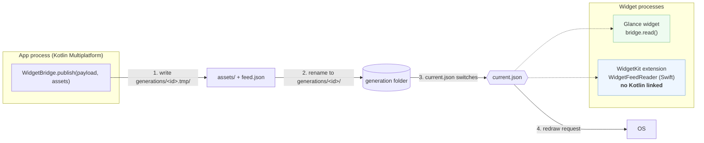

# WidgetBridge

Typed, atomic handoff of data and images from a Kotlin Multiplatform app to its home-screen
widgets: Jetpack Glance on Android, WidgetKit on iOS. **The widget extension never links Kotlin.**


[](https://central.sonatype.com/artifact/com.vocabloot/widgetbridge)
[](https://github.com/vaazh-studios/widgetbridge/actions/workflows/ci.yml)
[](https://kotlinlang.org)
[](LICENSE)
[](https://vaazh-studios.github.io/widgetbridge/)

## The problem

Widgets cannot run your shared Kotlin. On iOS the widget is a separate extension with a memory
ceiling around 30 MB: link the Kotlin framework into it and it gets killed, and App Store
validation rejects frameworks nested in extensions. On Android, Glance widgets wake when the app
is not running. So every KMP app hand-rolls the same handoff, usually a JSON string in
`UserDefaults`, with no atomicity across files, no images, and no recovery from a corrupt write.

WidgetBridge is that handoff done once: the app **publishes** a typed payload plus image assets
as a complete generation folder and flips an atomic pointer; the widget **reads** it with a
Kotlin reader (Glance) or a ten-line Swift package (WidgetKit).

## Features

- **Typed payload.** Your `@Serializable` class in, the same shape out in Kotlin and as `Decodable` in Swift.
- **Atomic generations.** A generation is written completely, renamed into place, then the pointer switches. A crash leaves the old or the new set, never a mix.
- **Fallback.** The previous generation is kept; readers fall back to it when the current one is corrupt or has the wrong schema version.
- **Images included.** Ship downsampled PNG or JPEG assets with the payload under a byte budget; readers resolve them with path-safety checks.
- **Dedupe.** Publishing unchanged content writes nothing and does not wake the widgets.
- **Redraw for free.** Android broadcasts the app-widget update; iOS posts a notification the Swift package turns into `WidgetCenter.reloadAllTimelines()`.
- **Same rotation on both platforms.** Deterministic hourly slot math with shared test vectors, so Android and iOS show the same item at the same hour.
- **Small.** Kotlin: coroutines and kotlinx-serialization only. Swift: Foundation only. No Glance, no DI framework, no UI.

## Support matrix

| | Android (Glance) | iOS (WidgetKit) |
|---|---|---|
| Publish from Kotlin | ✅ `androidWidgetBridge` | ✅ `iosWidgetBridge` (App Group) |
| Read | ✅ Kotlin `bridge.read()` | ✅ Swift `WidgetFeedReader` |
| Images | ✅ `WidgetImages` + `AssetBudget` | ✅ same |
| Redraw | `ACTION_APPWIDGET_UPDATE` broadcast | `WidgetBridgeReloader` |
| Kotlin in the widget process | Glance runs in the app process | never |
| Verified on device | ships in Vocabloot | ships in Vocabloot |

Targets: `android` (minSdk 24), `iosArm64`, `iosSimulatorArm64`, `iosX64`; Swift package iOS 16+.

## Who's using it

- [Vocabloot](https://vocabloot.com) ([App Store](https://apps.apple.com/app/id6792888619), [Google Play](https://play.google.com/store/apps/details?id=com.tntstudios.snaplingo)): the vocabulary lock-screen and home-screen widgets on both platforms run on this exact handoff (48 images per generation, hourly rotation, "feature this word" override).

## Install

Kotlin (shared module):
```kotlin
commonMain.dependencies {
    implementation("com.vocabloot:widgetbridge:0.1.0")
}
```

Swift (add to the **widget extension** target, and to the app target for the reloader):
```swift
.package(url: "https://github.com/vaazh-studios/widgetbridge", from: "0.1.0")
```

Then the platform setup once: [Android](docs/setup-android.md) (a Glance receiver), [iOS](docs/setup-ios.md) (an App Group on both targets).

## Quickstart

Kotlin, shared code:
```kotlin
@Serializable
data class QuoteFeed(val quotes: List<Quote>, val emptyText: String)   // pre-localised strings

val bridge = androidWidgetBridge(context, WidgetBridgeConfig(schemaVersion = 1), QuoteFeed.serializer(), QuoteWidgetReceiver::class.java)
// iOS: iosWidgetBridge(WidgetBridgeConfig(schemaVersion = 1, iosAppGroup = "group.com.example.quotes"), QuoteFeed.serializer())

val assets = AssetBudget().pack(quotes.map { AssetCandidate("${it.id}.jpg", it.photoPath, WidgetImageFormat.Jpeg) })
when (bridge.publish(QuoteFeed(quotes, emptyText), assets)) {
    is PublishResult.Published -> Unit   // widgets were asked to redraw
    PublishResult.Unchanged -> Unit      // nothing written
}
```

Android, inside `GlanceAppWidget.provideGlance`:
```kotlin
val feed = bridge.read() ?: return provideContent { EmptyCard() }
val index = WidgetRotation.index(WidgetRotation.hourSlot(now, zoneOffsetSeconds), feed.payload.quotes.size)
val bitmap = feed.assetPath("${feed.payload.quotes[index].id}.jpg")?.let(BitmapFactory::decodeFile)
```

iOS, inside the `TimelineProvider`:
```swift
let reader = WidgetFeedReader(appGroup: "group.com.example.quotes", schemaVersion: 1)
guard let feed = reader?.read(QuoteFeed.self) else { return empty }
let index = WidgetRotation.index(slot: WidgetRotation.hourSlot(date), count: feed.payload.quotes.count)
let image = feed.assetURL("\(feed.payload.quotes[index].id).jpg").flatMap { UIImage(contentsOfFile: $0.path) }
```

The sample app in [`sample/`](sample) is this quickstart with a UI on both platforms.

## How it works



```
<root>/widgetbridge/
  current.json                 {"current":"<id>","previous":["<id>"]}
  generations/<id>/feed.json   {"schemaVersion":1,"generatedAtEpochMs":…,"fingerprint":"<sha256>","payload":{…}}
  generations/<id>/assets/…
  generations/<id>.tmp/        in progress, ignored by readers
```

`<root>` is the app's files dir on Android and the App Group container on iOS. Readers try the
pointer's current, then its previous list, then any other generation newest first, and take the
first that parses with the expected schema version. Details: [docs/feed-format.md](docs/feed-format.md).

## When to publish

WidgetBridge does one publish per call and nothing in the background. Republish when your data
changes and when the locale changes; a debounce and a foreground trigger are twelve lines:
[docs/refresh.md](docs/refresh.md).

## Limits and honesty

- No widget UI: you write the Glance and SwiftUI views. For "write the UI once in Kotlin" see [WARP](https://github.com/DevAtrii/Warp).
- No scheduling: the OS decides when widgets redraw; `publish` only asks.
- The extension has no access to your Compose resources: put localised strings in the payload.
- iOS needs the App Group on **both** targets; without it `WidgetFeedReader(appGroup:)` returns nil and `iosWidgetBridge` throws on first use.
- Android storage lives in the app's private files dir, so only the app's own widgets can read it. Correct for Glance, not a cross-app channel.

## Compared with

| | Hand-rolled UserDefaults / MatchPin | WARP | Fidget | WidgetBridge |
|---|---|---|---|---|
| Kotlin in the iOS extension | yes | yes | yes (Compose in WidgetKit) | **no** |
| Atomic across payload + images | no | no | n/a | **yes** |
| Fallback after a corrupt write | no | no | n/a | **yes** |
| Images | manual | manual | Compose-rendered | **budgeted assets** |
| Schema version check | no | no | n/a | **yes** |
| Widget UI | yours | Kotlin DSL | Compose | yours |

## Documentation

- [Android setup](docs/setup-android.md), [iOS setup](docs/setup-ios.md)
- [Feed format and reader rules](docs/feed-format.md)
- [When to publish](docs/refresh.md)
- [Design](docs/design.md), [Publishing](docs/publishing.md) (maintainers)
- [API reference](https://vaazh-studios.github.io/widgetbridge/) (Dokka); Kotlin ABI tracked in [`widgetbridge/api`](widgetbridge/api).

## Dependencies

Kotlin: `kotlinx-coroutines-core`, `kotlinx-serialization-json` (both exposed). Android: platform APIs only. iOS: Foundation only. Swift package: Foundation, and WidgetKit only inside `WidgetBridgeReloader`.

## License

Apache 2.0. Made by [Vaazh Studios](https://github.com/vaazh-studios).
