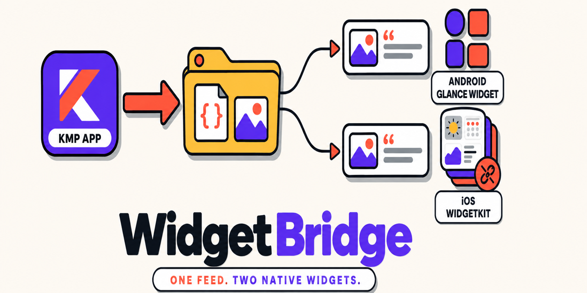
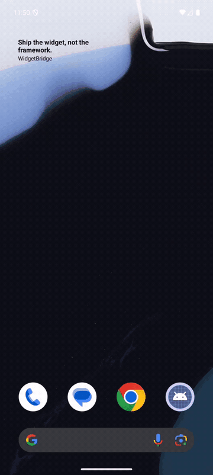
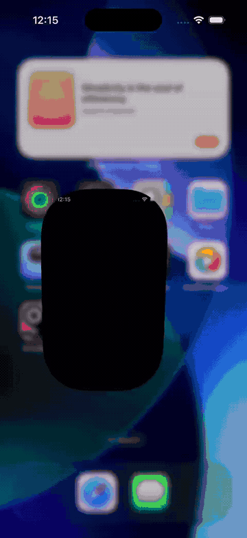

# WidgetBridge



Typed, atomic handoff of data and images from a Kotlin Multiplatform app to its home-screen widgets: Jetpack Glance on Android, WidgetKit on iOS. **The widget extension never links Kotlin.**


[](https://central.sonatype.com/artifact/com.vocabloot/widgetbridge)
[](https://github.com/vaazh-studios/widgetbridge/actions/workflows/ci.yml)
[](https://kotlinlang.org)
[](LICENSE)
[](https://vaazh-studios.github.io/widgetbridge/)
[](https://github.com/vaazh-studios/widgetbridge/discussions)

- [Why](#why) · [Features](#features) · [WidgetBridge 101](#widgetbridge-101) · [A more advanced example](#a-more-advanced-example)
- [Support matrix](#support-matrix) · [Requirements](#requirements) · [Samples](#samples) · [Testing](#testing)
- [Who's using it](#whos-using-it) · [Communication](#communication) · [Limits and honesty](#limits-and-honesty) · [Compared with](#compared-with)

## Why

Widgets cannot run your shared Kotlin. On iOS the widget is a separate extension with a memory
ceiling around 30 MB: link the Kotlin framework into it and it gets killed, and App Store
validation rejects frameworks nested in extensions. On Android, Glance widgets wake when the app
is not running. So every KMP app hand-rolls the same handoff, usually a JSON string in
`UserDefaults`, with no atomicity across files, no images, and no recovery from a corrupt write.

WidgetBridge is that handoff done once: the app **publishes** a typed payload plus image assets
as a complete generation folder and flips an atomic pointer; the widget **reads** it with a
Kotlin reader (Glance) or a ten-line Swift package (WidgetKit).

## Features

- **Typed payload.** Your `@Serializable` class in, the same shape out in Kotlin and as `Decodable` in Swift.
- **Atomic generations with fallback.** Written completely, renamed into place, pointer switched; readers fall back to the previous generation when the current one is corrupt or has the wrong schema.
- **Images included.** Downsampled PNG or JPEG assets under a byte budget, resolved with path-safety checks.
- **Dedupe and redraw.** Unchanged content writes nothing; changed content asks the OS to redraw on both platforms.
- **Same rotation on both platforms.** Hourly slot math with test vectors shared between Kotlin and Swift.
- **Small.** Kotlin: coroutines and kotlinx-serialization. Swift: Foundation. No Glance dependency, no DI, no UI.

## WidgetBridge 101

```kotlin
// libs.versions.toml            widgetbridge = { module = "com.vocabloot:widgetbridge", version = "0.2.0" }
// build.gradle.kts (shared)     commonMain.dependencies { implementation(libs.widgetbridge) }
```
```swift
// Package.swift or Xcode, on the widget extension AND the app target
.package(url: "https://github.com/vaazh-studios/widgetbridge", from: "0.2.0")
```

An App Group on both iOS targets, a Glance receiver on Android ([setup](https://vaazh-studios.github.io/widgetbridge/setup-android/)), then:

```kotlin
// shared
@Serializable
data class QuoteFeed(val quotes: List<Quote>, val emptyText: String)      // pre-localised strings

// Android (androidMain)                                                    // iOS (iosMain)
val bridge = androidWidgetBridge(                                           val bridge = iosWidgetBridge(
    context, WidgetBridgeConfig(schemaVersion = 1),                             WidgetBridgeConfig(schemaVersion = 1, iosAppGroup = "group.com.example.quotes"),
    QuoteFeed.serializer(), QuoteWidgetReceiver::class.java,                    QuoteFeed.serializer(),
)                                                                           )

// publish whenever the data changes (debounced)
val assets = AssetBudget().pack(quotes.map { AssetCandidate("${'$'}{it.id}.jpg", it.photoPath, WidgetImageFormat.Jpeg) })
when (bridge.publish(QuoteFeed(quotes, emptyText), assets)) {
    is PublishResult.Published -> Unit   // widgets were asked to redraw
    PublishResult.Unchanged -> Unit      // nothing written
}
```

```kotlin
// Android widget, inside provideGlance: read INSIDE the composition, keyed on the receiver's counter
provideContent {
    val refresh by QuoteWidget.refreshes.collectAsState()
    val feed = remember(refresh) { bridge.read() }
    val index = WidgetRotation.index(WidgetRotation.hourSlot(System.currentTimeMillis(), zoneOffsetSeconds), feed?.payload?.quotes?.size ?: 1)
    val bitmap = feed?.assetPath("${'$'}{feed.payload.quotes[index].id}.jpg")?.let(BitmapFactory::decodeFile)
    QuoteCard(feed?.payload?.quotes?.getOrNull(index), bitmap)
}
```

```swift
// iOS widget, inside the TimelineProvider
let reader = WidgetFeedReader(appGroup: "group.com.example.quotes", schemaVersion: 1)
guard let feed = reader?.read(QuoteFeed.self) else { return empty }
let index = WidgetRotation.index(slot: WidgetRotation.hourSlot(date), count: feed.payload.quotes.count)
let image = feed.assetURL("\(feed.payload.quotes[index].id).jpg").flatMap { UIImage(contentsOfFile: $0.path) }
```

## A more advanced example

Skip the encode when nothing changed, and let iOS flip the word on the hour without the app running:

```kotlin
@Serializable data class QuoteFeed(val sourceFingerprint: String, val quotes: List<Quote>, val emptyText: String)

suspend fun publishIfChanged(quotes: List<Quote>) {
    val fingerprint = sha256Hex(quotes.joinToString("\u001f") { "${'$'}{it.id}|${'$'}{it.text}|${'$'}{it.photoPath}" }.encodeToByteArray())
    if (bridge.read()?.payload?.sourceFingerprint == fingerprint) return          // one file read, zero encodes
    bridge.publish(QuoteFeed(fingerprint, quotes, emptyText), AssetBudget().pack(candidates(quotes)))
}
```

A 24-entry WidgetKit timeline, Lock Screen families, several widgets from one feed and localized payloads: [recipes](https://vaazh-studios.github.io/widgetbridge/recipes/).

## Support matrix

| | Android (Glance) | iOS (WidgetKit) |
|---|---|---|
| Publish from Kotlin | ✅ `androidWidgetBridge` | ✅ `iosWidgetBridge` (App Group) |
| Read | ✅ Kotlin `bridge.read()` | ✅ Swift `WidgetFeedReader` |
| Images | ✅ `WidgetImages` + `AssetBudget` | ✅ same |
| Redraw | `ACTION_APPWIDGET_UPDATE` broadcast | `WidgetBridgeReloader` |
| Kotlin in the widget process | Glance runs in the app process | never |
| Verified | Vocabloot development build, Pixel 10 Pro emulator, 2026-09-08 | Vocabloot development build, iPhone 17 Pro simulator, 2026-09-08 |

Targets: `android` (minSdk 24), `iosArm64`, `iosSimulatorArm64`, `iosX64`; Swift package iOS 16+.

## Requirements

| | Minimum | Built with |
|---|---|---|
| Kotlin / Gradle / AGP | 2.3 / 9.0 / 9.0 | 2.3.20 / 9.4.1 / 9.2.1 |
| Android | minSdk 24, Glance 1.1 in your app | compileSdk 36 |
| iOS / Xcode / Swift tools | 16 / 16 / 5.9 | iOS 26 / Xcode 26 |

Versioning, the on-disk format promise and the requirements in full: [stability](https://vaazh-studios.github.io/widgetbridge/stability/).

## Samples

| Sample | Shows | Android | iOS |
|---|---|---|---|
| [Quote of the day](sample/README.md) | debounced publish, images under budget, Glance re-read, WidgetKit timeline, featured override |  |  |

## Testing

`com.vocabloot:widgetbridge-test` ships the fakes the library's own tests run on:

```kotlin
val storage = FakeWidgetFeedStorage(); val notifier = CountingNotifier()
val bridge = WidgetBridge(WidgetBridgeConfig(schemaVersion = 1), QuoteFeed.serializer(), storage, notifier, clock = { 1L })
bridge.publish(feed, assets); bridge.publish(feed, assets)
check(storage.writeCount == 1 && notifier.count == 1)                          // dedupe held
```

## Who's using it

- [Vocabloot](https://vocabloot.com) ([App Store](https://apps.apple.com/app/id6792888619), [Google Play](https://play.google.com/store/apps/details?id=com.tntstudios.snaplingo)): the vocabulary home-screen and lock-screen widgets (48 images per generation, hourly rotation, "feature this word" override). The library was extracted from that code; Vocabloot 1.2 is the first store build that runs on the library itself.

Works with Glance, WidgetKit, kotlinx-serialization and whatever DI you use; the sample uses none. Using WidgetBridge? Open a PR and add yourself.

## Communication

- Questions and ideas: [Discussions](https://github.com/vaazh-studios/widgetbridge/discussions).
- Bugs: [Issues](https://github.com/vaazh-studios/widgetbridge/issues/new/choose), with the platform and the generation folder listing if you can.
- Security: [SECURITY.md](SECURITY.md), privately.
- Contributing: [CONTRIBUTING.md](CONTRIBUTING.md). Conduct: [CODE_OF_CONDUCT.md](CODE_OF_CONDUCT.md).

## Limits and honesty

- No widget UI: you write the Glance and SwiftUI views. For "write the UI once in Kotlin" see [WARP](https://github.com/DevAtrii/Warp).
- No scheduling: the OS decides when widgets redraw; `publish` only asks.
- The extension has no access to your Compose resources: put localised strings in the payload.
- iOS needs the App Group on **both** targets; without it `WidgetFeedReader(appGroup:)` returns nil and `iosWidgetBridge` throws on first use.
- Android storage lives in the app's private files dir, so only the app's own widgets can read it. Correct for Glance, not a cross-app channel.
- Verified so far on the Pixel 10 Pro emulator and the iPhone 17 Pro simulator through Vocabloot's development build (import, publish with images, widget placed, re-read after a change) and through the sample app. No physical-device pass and no store build carry it yet.
- The fingerprint covers the encoded asset bytes, so `publish` can only report `Unchanged` after your images are encoded. If encoding is expensive, keep a cheap fingerprint of your source data inside the payload and compare it with `bridge.read()?.payload` before packing assets ([docs/refresh.md](docs/refresh.md)).
- Glance keeps a widget composition alive for a while after it renders, and an update on a live session only recomposes. Read the feed **inside** `provideContent`, keyed on something the receiver bumps per update (the sample uses a `MutableStateFlow` counter), or a second `publish` within that window shows the first one's data.

Open items with workarounds: [known issues](https://vaazh-studios.github.io/widgetbridge/known-issues/).

## Compared with

| | Hand-rolled UserDefaults / MatchPin | WARP | Fidget | WidgetBridge |
|---|---|---|---|---|
| Kotlin in the iOS extension | yes | yes | yes (Compose in WidgetKit) | **no** |
| Atomic across payload + images | no | no | n/a | **yes** |
| Fallback after a corrupt write | no | no | n/a | **yes** |
| Images | manual | manual | Compose-rendered | **budgeted assets** |
| Schema version check | no | no | n/a | **yes** |
| Widget UI | yours | Kotlin DSL | Compose | yours |

## Documentation

[Docs site](https://vaazh-studios.github.io/widgetbridge/): setup, how it works, the feed format, when to publish, recipes, FAQ, known issues, stability. [API reference](https://vaazh-studios.github.io/widgetbridge/api/) (Dokka). Design notes and publishing steps in [docs/](docs/) for maintainers.

## Dependencies

Kotlin: `kotlinx-coroutines-core`, `kotlinx-serialization-json` (both exposed). Android: platform APIs only. iOS: Foundation only. Swift package: Foundation, and WidgetKit only inside `WidgetBridgeReloader`.

## License

Apache 2.0. Made by [Vaazh Studios](https://github.com/vaazh-studios).
