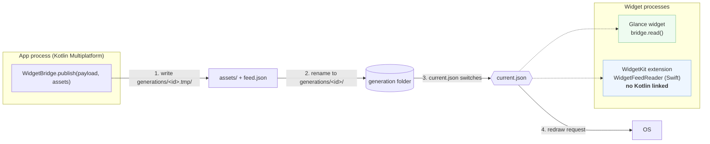

# How it works



```
<root>/widgetbridge/
  current.json                 {"current":"<id>","previous":["<id>"]}
  generations/<id>/feed.json   {"schemaVersion":1,"generatedAtEpochMs":…,"fingerprint":"<sha256>","payload":{…}}
  generations/<id>/assets/…
  generations/<id>.tmp/        in progress, ignored by readers
```

`<root>` is the app's files dir on Android and the App Group container on iOS. Readers try the
pointer's current, then its previous list, then any other generation newest first, and take the
first that parses with the expected schema version. Details: [docs/feed-format.md](docs/feed-format.md).
